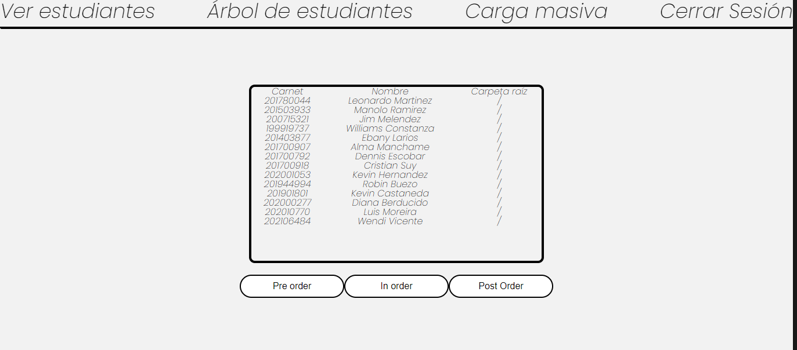
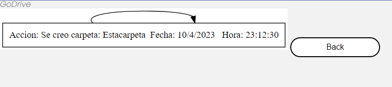

#### Universidad de San Carlos de Guatemala
#### Facultad de Ingenieria
#### Escuela de Sistemas
#### Estructuras de Datos 
#### Primer Semestre 2023
#### Luis Mariano Moreira García
# Manual de Usuario

## REQUIRIMIENTOS
- Navegador instalado
- 100mb de Ram
- Pentium 
- 100 mb de almacenamiento

## ALCANCE DEL PROGRAMA
- Poder ser utilizado para el manejo de datos
- Ser escalable con la web

## IFORMACIÓN GENERAL
-Godrive es un navegador de archivos totalmente confiable para los estudiantes de la Universidad de San Carlos 
-A continuación se explicará el uso de esta aplicación 
-Para iniciar sesión: 
 
-Para ingresar al modulo de administrador es necesario que ingreses: 
-User: admin 
-Pass: admin 
-Puedes verificar si tu contraseña es correcta pulsando el "ver contraseña" 
 
-El modulo de admin tendrá la siguiente forma si es primera vez que se visita: 
 
-Para hacer carga masiva y pulsa "cargar json" y luego "en cargar" informacion: 
 
-La estructura del json es la siguiente:
 
-Para visualizar el arbol pulsa "Arbol de estudiantes:  
 
-Para visualizar en pre order, post order e in order pulsa "Ver estudiantes:  
 
-Para salir pulsa "Cerrar Sesión"  
-Para iniciar sesion con un estudiante ingresa el numero de carnet y la contraseña  
-A continuación se muestra el modulo de usuario:  
 
 
 
 
 
-Mensajeria:
-Para escribir mensajes a otros usuarios tenemos lo siguiente:
 
 
-Para seleccionar el mensaje para enviar:
 
-Se escribe y luego se envia:
 
-Si se inicia con un usario distinto el cambio se verá reflejado acorde al orden:
-Derecha: El mensaje que has enviado
-Izquierda: El mensaje que te han enviado.
 
-En el modulo de administrador se puede visualizar la tabla hash cargada en inorder:
 
-Para visualizar el contenido del blockchain:
 
 

